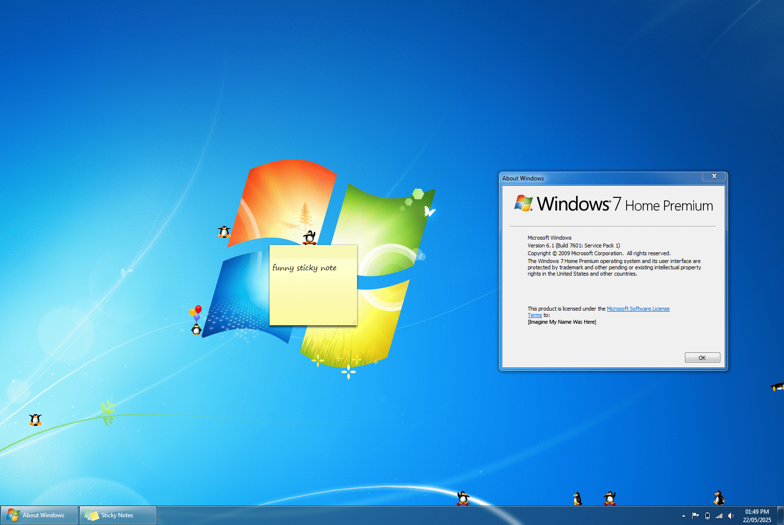

# WinPenguins (Windows 7 Version)
### Verison 1.1-W7 (May 22, 2025)

 Penguins wander around your desktop and engage in activities such as reading and skateboarding!

~Screenshot of WinPenguins 1.1-W7 running on Windows 7~

~Screenshot of WinPenguins 1.0 running on Windows 10~

# Known Bugs
- Attempting to screenshot causes a buffer overrun **Workaround: press ignore to save the screenshot, then close WinPenguins before it Crashes**

# System Requirements
The modern fork WinPenguins runs under Windows 10 & 11, this version will also run under Windows 7, will very likely run on windows 8, and possibly run on Vista (I can't test Vista or 8 as I only have Windows 7) For Windows XP or older, use the original version of WinPenguins, availible [here](https://winpenguins.sourceforge.io/)

## Usage

* Position the cursor or a window over a penguin to explode it. (will make an option to disable this sometime)
* Position the cursor over balloons to pop them and cause the penguin to tumble! 
* Use the arrow keys or WASD keys to change the direction of Skateboarder Penguins.
* WinPenguins creates a penguin icon in the Taskbar Notification Area (located at the right end of the Windows Taskbar).  
   - Left click to access Settings.
   - To shutdown WinPenguins, right click to open the menu and click Exit.
   - To take a screenshot, right click to open the menu and click Screenshot... 

## [Changelog & New Features](./Changelog.txt)

## Acknowledgements

Thank you to Riccardo Marcangelo (ricky65) for updating and maintaining WinPenguins 

Thank you to Michael Vines for creating the original version of WinPenguins.

WinPenguins is a Windows API rewrite of the X-Windows application XPenguins. The XPenguins homepage is located at http://xpenguins.seul.org/, and was written by Robin Hogan.

The penguin images were taken from 'Pingus', a free lemmings clone for GNU/Linux (http://pingus.seul.org), and were designed by Joel Fauche. 

## Contributing

If you wish to contribute, please make your own fork or base it on https://github.com/ricky65/WinPenguins, I am not the most 'active' developer.

## License

WinPenguins is released under the GNU General Public License Version 2. See the file [COPYING.txt](./COPYING.txt) for details.